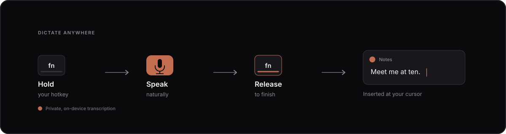

<p align="center">
  
</p>

<h1 align="center">Open Memo</h1>

<p align="center">
  Push-to-talk dictation that runs privately on your Mac.
</p>

<p align="center">
  <a href="https://github.com/oliverbhull/open-memo/releases/latest/download/Open-Memo-latest-arm64.dmg">
    
  </a>
</p>

<p align="center">
  <a href="https://github.com/oliverbhull/open-memo/releases"></a>
  <a href="LICENSE"></a>
  
  
  <a href="https://github.com/oliverbhull/open-memo/actions/workflows/ci.yml"></a>
</p>

Hold a hotkey, speak naturally, and release. Open Memo adds punctuation and
places the finished text wherever your cursor is—without an account,
subscription, or cloud transcription.

## How it works



## Install

1. Download and open the `.dmg`.
2. Drag **Memo** into the **Applications** folder.
3. Open Memo and allow the permissions macOS requests.
4. Choose a hotkey and start dictating.

Open Memo requires macOS 15 or newer on an Apple silicon Mac. Looking for an
older version? Visit [GitHub Releases](https://github.com/oliverbhull/open-memo/releases).

## Built for everyday writing

- **Works anywhere** — dictate into email, messages, notes, documents, and more.
- **Runs locally** — your speech is transcribed on your Mac.
- **Writes naturally** — automatic punctuation and capitalization clean up your words.
- **Keeps a history** — find and reuse previous dictations.
- **Gives you control** — saving the original audio is optional and off by default.
- **Connects to Memo** — supports Memo Bluetooth microphones and recorders.

Granite is included and ready to use. You can also choose Whisper in Settings;
Memo downloads it once and then runs it locally.

## Permissions and privacy

Memo needs **Microphone** access to hear you, **Accessibility** access to insert
text, and **Input Monitoring** access to detect your hotkey. Bluetooth permission
is only needed when using a Memo Bluetooth microphone.

Open Memo does not require an account. Audio retention is off by default. If you
turn on **Save dictation audio**, recordings remain in Memo's local app-data
folder until you delete them.

## For developers

Open Memo is open source under the [MIT License](LICENSE). To run it locally,
you'll need macOS, Node.js 22.12+, Rust 1.88.0+, Xcode Command Line Tools,
[`uv`](https://docs.astral.sh/uv/), and the
[Hugging Face CLI](https://huggingface.co/docs/huggingface_hub/guides/cli).

```bash
git clone https://github.com/oliverbhull/open-memo.git
cd open-memo
npm install
npm run check
npm run dev
```

## Learn more

[Contributing](CONTRIBUTING.md) ·
[Troubleshooting](docs/troubleshooting.md) ·
[Changelog](CHANGELOG.md) ·
[Support](SUPPORT.md) ·
[Security](SECURITY.md) ·
[Signing and release](docs/maintainers/signing-and-release.md)
