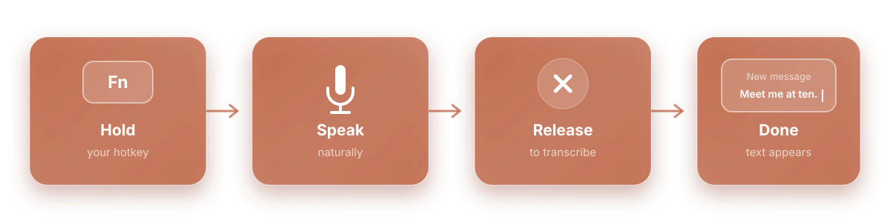

<p align="center">
  
</p>

<h1 align="center">Open Memo</h1>

<p align="center">
  <strong>Talk instead of type.</strong><br>
  Free, private voice dictation for your Mac.<br>
  Works in every app—even offline.
</p>

<p align="center">
  <strong>Free forever. Unlimited dictation. No account required.</strong><br>
  No subscriptions, credits, or word limits.
</p>

<p align="center">
  <a href="https://github.com/oliverbhull/open-memo/releases/latest/download/Open-Memo-latest-arm64.dmg">
    
  </a>
</p>

<p align="center">
  <a href="https://github.com/oliverbhull/open-memo/releases"></a>
  <a href="LICENSE"></a>
  
  
  <a href="https://github.com/oliverbhull/open-memo/actions/workflows/ci.yml"></a>
</p>

Open Memo lets you speak naturally and write anywhere on your Mac. Hold **Fn**,
speak, and release. Your words appear wherever your cursor is.

Dictation runs locally, works without an internet connection, and never consumes
credits or hits a weekly word limit. Your voice is not sent to a cloud
transcription service.

## How it works



## Why Open Memo?

- **It works anywhere you can type.** Use it for messages, email, notes, and documents.
- **It makes speech readable.** Punctuation and capitalization are added automatically.
- **It stays on your Mac.** Your voice is transcribed locally, not sent to the cloud.

Your recent dictations stay in a simple history so you can find and reuse them.
Saving the original audio is optional and off by default.

## Get started

1. [Download Open Memo](https://github.com/oliverbhull/open-memo/releases/latest/download/Open-Memo-latest-arm64.dmg).
2. Open the `.dmg` and drag **Memo** into **Applications**.
3. Open Memo and allow the requested permissions.
4. Hold **Fn** and start talking.

Open Memo requires macOS 15 or newer and an Apple silicon Mac.
Conomo is included and ready to use. You can also choose Whisper in Settings;
Memo downloads it once and then runs it locally.

## Private by design

Speech is transcribed on your Mac. Open Memo does not require an account and
does not send your dictation to a transcription service.

Memo needs Microphone access to hear you, Accessibility access to insert text,
and Input Monitoring access to detect the hotkey. Bluetooth is only used if you
connect a Memo microphone or recorder.

## For developers

Open Memo is open source under the [MIT License](LICENSE).

```bash
git clone https://github.com/oliverbhull/open-memo.git
cd open-memo
npm install
npm run check
npm run dev
```
